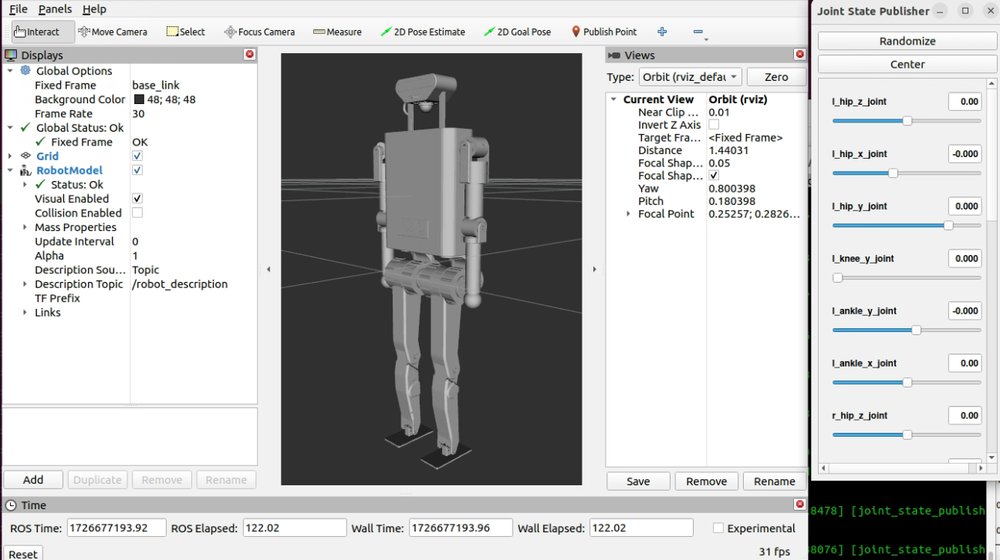

# BXI Robot description files
The main contents of this repository include:

* Robot ELF/Dwarf description files of xxx.urdf, xxx.xml(used by mujoco), mesh files of .stl .     
* Demo programs to visualize the robot description files.    
    
    
# Software requirements
* Ubuntu22 + ROS2
* python3

# Buid & Run

1. The repo is a standard ROS workspace directory. Follow the ROS way to build: 
    ```
    cd root_dir_of_repo;
    colcon build
    ```
    There should be new directories showing up: build, install, log 

2. run
    ```bash
    （in root_dir_of_repo）
    source ./install/setup.bash  # active current workspace setting
    ros2 launch visualization xxxx.py  # xxx.py is program for per robot
    ```
    The py program launches state publishers and rviz to visualize the data.

# Use robot description in other projects.
* The `description` directory is a standard ROS package. 
* Use raw urdf/xml/stl files. 


